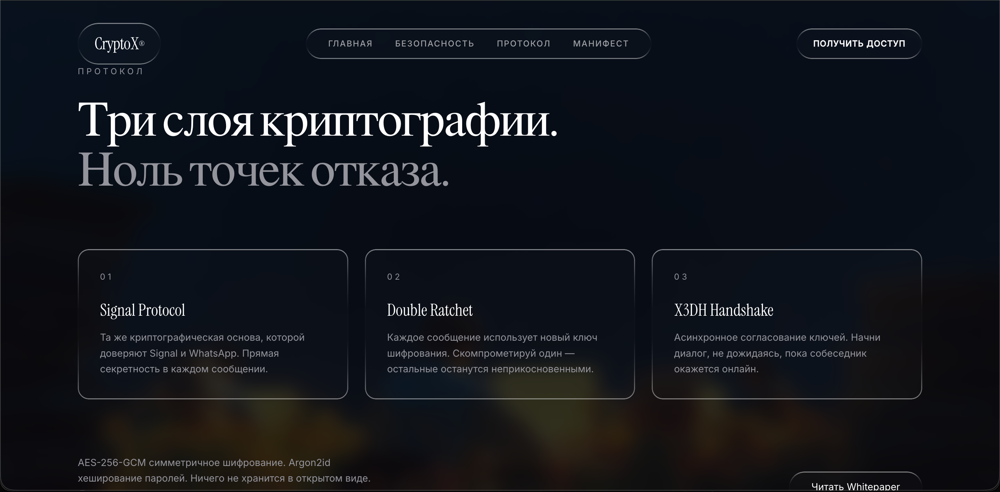
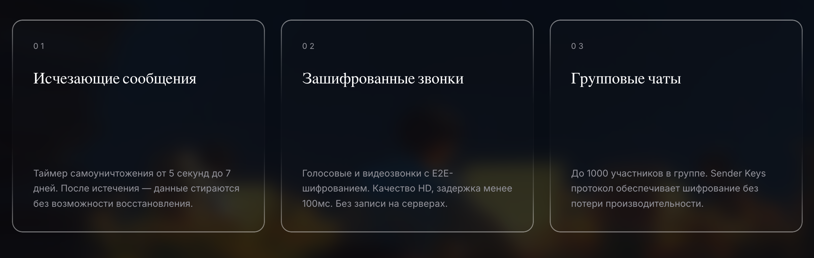

# Liquid Glass CSS

[English](./README.md) | [Русский](./README.ru.md)

[](https://github.com/GANSGX/liquid-glass-css/releases)
[](./LICENSE)
[](https://github.com/GANSGX/liquid-glass-css/issues)
[](./CONTRIBUTING.md)

Minimal, dark-first liquid glass CSS kit built for production UI surfaces.

## Primary Demo

This repository is intentionally base-focused.  
The main visual concept and showcase is available on the author's mock site:

- [test-motion-design.vercel.app](https://test-motion-design.vercel.app/)

## What You Get

- Pure CSS liquid glass styles (no JavaScript)
- Clean base preset for reusable UI blocks
- Strong preset for navigation and active elements
- Form-ready helpers for fast prototyping

## Installation

```bash
git clone https://github.com/GANSGX/liquid-glass-css.git
cd liquid-glass-css
```

Include stylesheet:

```html
<link rel="stylesheet" href="./css/liquid-glass.css">
```

## Quick Start

```html
<section class="glass-form liquid-glass">
  <h1 class="glass-title">Welcome Back</h1>
  <input class="glass-input" placeholder="Email" />
  <button class="glass-button">Sign In</button>
</section>
```

## Core Classes

- `.liquid-glass` - base glass surface
- `.nav-blob` - stronger glass surface for nav/active controls
- `.glass-form` - compact panel wrapper
- `.glass-input` / `.glass-textarea` - form fields
- `.glass-button` / `.glass-button.secondary` - action buttons

## Local Examples

- [examples/form-login.html](./examples/form-login.html)
- [examples/form-contact.html](./examples/form-contact.html)
- [examples/variants.html](./examples/variants.html)

## Mock Reference Screenshots

Hero section:


Protocol section:



Feature cards:



## Local Preview

```bash
open ./examples/variants.html
```

or

```bash
npx serve .
```

## License

MIT
