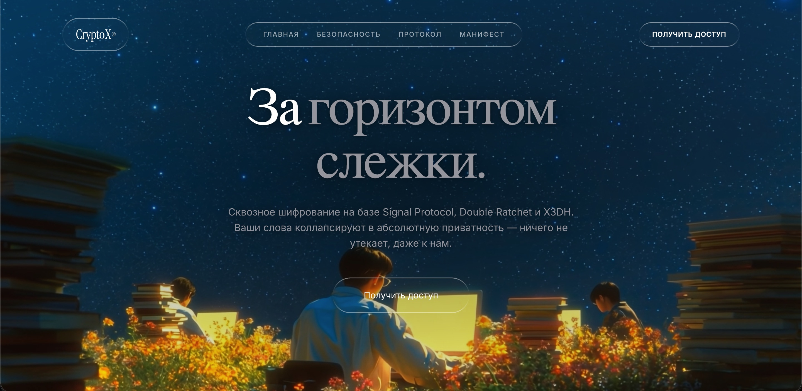
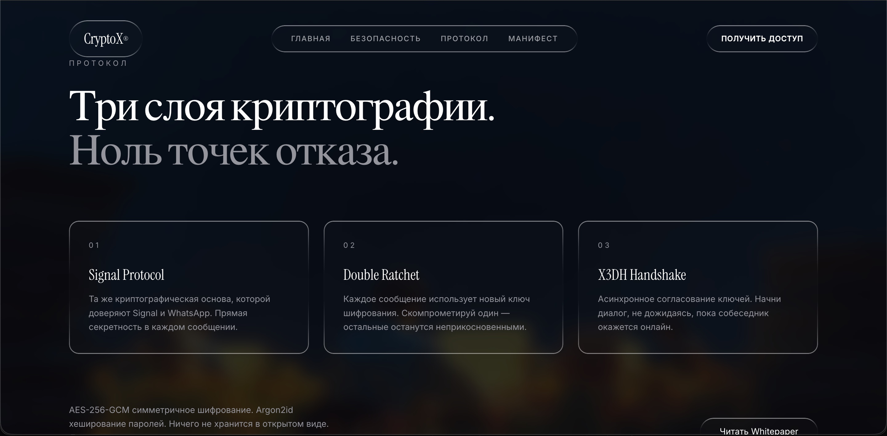
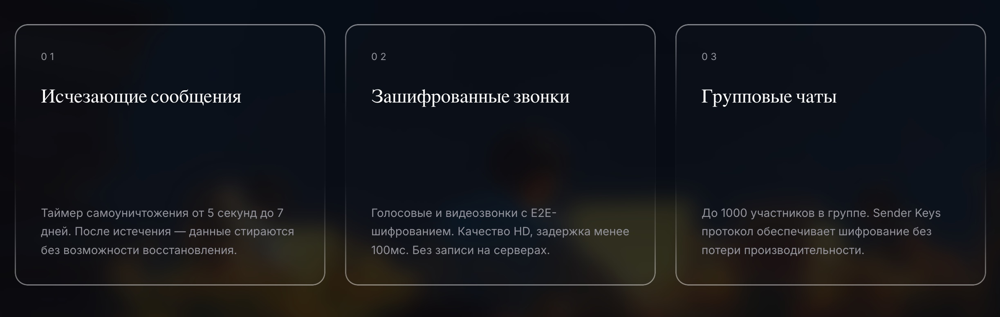

<h1 align="center">Liquid Glass CSS</h1>

<p align="center">
  <a href="./README.md">English</a> | <a href="./README.ru.md">Русский</a>
</p>

<p align="center">
  <strong>Минималистичный dark-first набор liquid glass стилей на чистом CSS для реальных интерфейсов.</strong>
</p>

<p align="center">
  <a href="https://test-motion-design.vercel.app/"></a>
  <a href="#"></a>
  <a href="#"></a>
  <a href="#"></a>
</p>

---

## ✦ Основной Демо-референс

Этот репозиторий специально сфокусирован на базовых стилях.  
Главная визуальная концепция и showcase находятся на mock-сайте автора:

- [test-motion-design.vercel.app](https://test-motion-design.vercel.app/)

## ✦ Что Внутри

- Liquid glass стили на чистом CSS без JavaScript
- Базовый пресет для переиспользуемых блоков
- Усиленный пресет для навигации и активных элементов
- Вспомогательные классы для форм

## ✦ Установка

```bash
git clone https://github.com/GANSGX/liquid-glass-css.git
cd liquid-glass-css
```

Подключение:

```html
<link rel="stylesheet" href="./src/liquid-glass.css">
```

## ✦ Быстрый Старт

```html
<section class="glass-form liquid-glass">
  <h1 class="glass-title">Welcome Back</h1>
  <input class="glass-input" placeholder="Email" />
  <button class="glass-button">Sign In</button>
</section>
```

## ✦ Основные Классы

- `.liquid-glass` - базовая стеклянная поверхность
- `.nav-blob` - усиленная стеклянная поверхность для навигации/активных состояний
- `.glass-form` - компактная обертка-панель
- `.glass-input` / `.glass-textarea` - поля формы
- `.glass-button` / `.glass-button.secondary` - кнопки действий

<br/>

## ✦ Локальные Примеры

- [examples/form-login.html](./examples/form-login.html)
- [examples/form-contact.html](./examples/form-contact.html)
- [examples/variants.html](./examples/variants.html)

<br/>

## ✦ Скриншоты Mock-референса

Hero секция:



Секция протокола:



Карточки фич:



<br/>

## ✦ Локальный Просмотр

```bash
open ./examples/variants.html
```

или

```bash
npx serve .
```

## ✦ Лицензия

MIT
